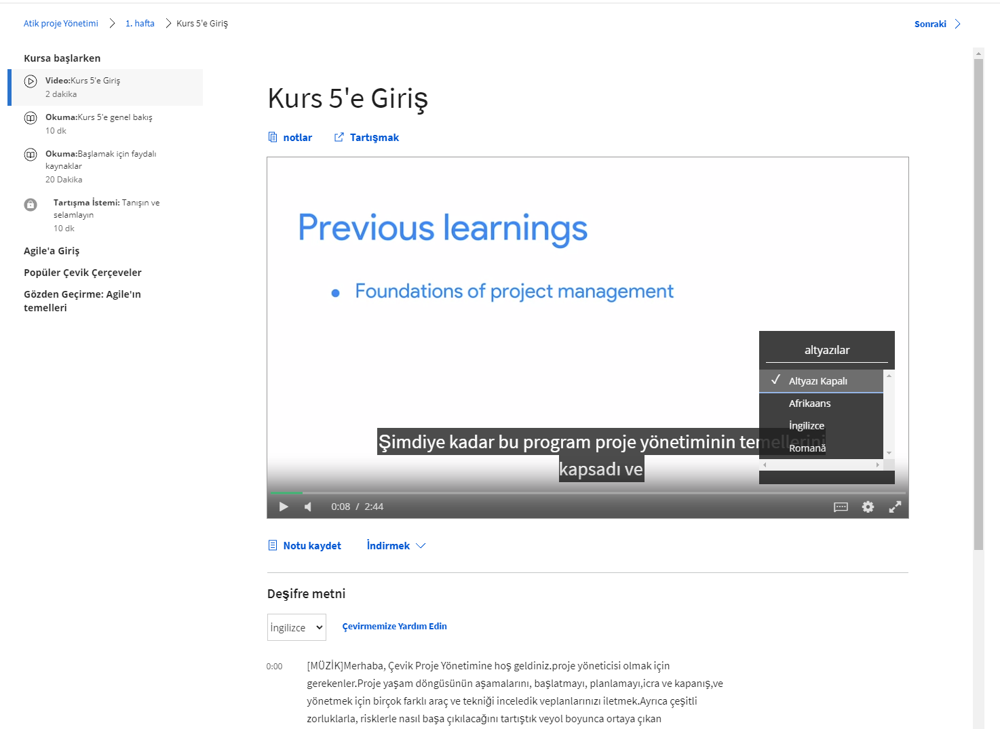

# Coursera Subtitle Google Translate UserScript

  

## Description
It allows you to export the translated text from the Chrome page renderer that appears below the video to the video itself. In addition, it automatically disables the default subtitles shown in the video and you have to manually translate the web page into your preferred language using the browser's built-in page translation feature.

## Installation
To use this UserScript, you need a browser extension like Tampermonkey (for Chrome) or Greasemonkey (for Firefox) installed. Follow the steps below to install the script:

1. Install the Tampermonkey/Greasemonkey extension in your browser if you haven't already.
2. Create a new Tampermonkey/Greasemonkey script.
3. Copy and paste the entire content of the JS code provided into the script editor.
4. Save the script.

## Features
- Translates subtitles on Coursera.
- Styling enhancements to improve subtitle visibility and presentation.

## How it Works
The UserScript targets the Coursera website and executes when you visit any course page (URL starting with `https://www.coursera.org/learn/`).

When the UserScript runs, it injects custom CSS styles into the page. These styles modify the appearance and positioning of the subtitles. It creates a popup-like element with white text color, a semi-transparent black background, and rounded corners to display the translated subtitles on top of the original subtitles. The translated subtitles are centered and positioned above the original subtitles for better visibility.

## Usage
Once the UserScript is installed and running, you can use the following features:

1. **Disable Subtitles on the Video:** To disable the original subtitles on the video page, you can use the video player's built-in subtitle toggle button. This toggle button will not interfere with the custom styles added by the UserScript.

2. **Translate the Video Page Using Chrome Page Translation Tool:** You can use your browser's Chrome page translation feature to translate the video page instantly into your preferred language. Here's how you can do it:
    - Go to the Coursera video page in your browser.
    - Click on the "Translate" icon located at the top right corner of your browser's address bar.
    - Use the "Change Language" option to translate the page into your preferred language.

## Note
This script relies on the structure and classes of the Coursera website as of the last update. If Coursera updates its structure or classes, the UserScript might require adjustments to work correctly.

## Disclaimer
This UserScript is provided as-is and is not associated with or endorsed by Coursera or Google. The user is responsible for its usage and any consequences that may arise from using this script.

## Author
This UserScript is developed by hcode.

## Version
Current version: 0.1

## License
This UserScript is distributed under the MIT License. Feel free to modify and distribute it as per the terms of the license.

## Support and Contributions
For any issues or suggestions, please feel free to open an issue or contribute to the project on the [GitHub repository](https://github.com/hcode/coursera-subtitle-translate).

Happy learning with translated subtitles!
